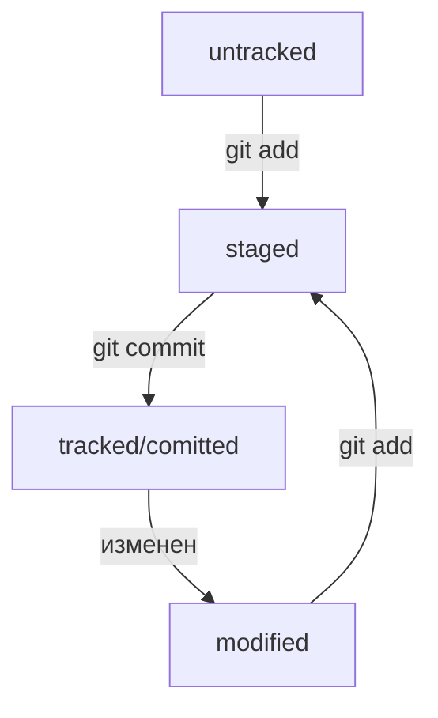

Большинство файлов в проектах «шагает» по следующему циклу: «изменён» → «добавлен в список на коммит» → «закоммичен» → «изменён» → и так далее.

```mermaid
graph TB;
  untracked -- "git add" --> staged;
  staged    -- "git commit"     --> tracked/comitted;
  tracked/comitted   -- "изменен"     --> modified;
  modified -- "git add"     --> staged;

``` 
