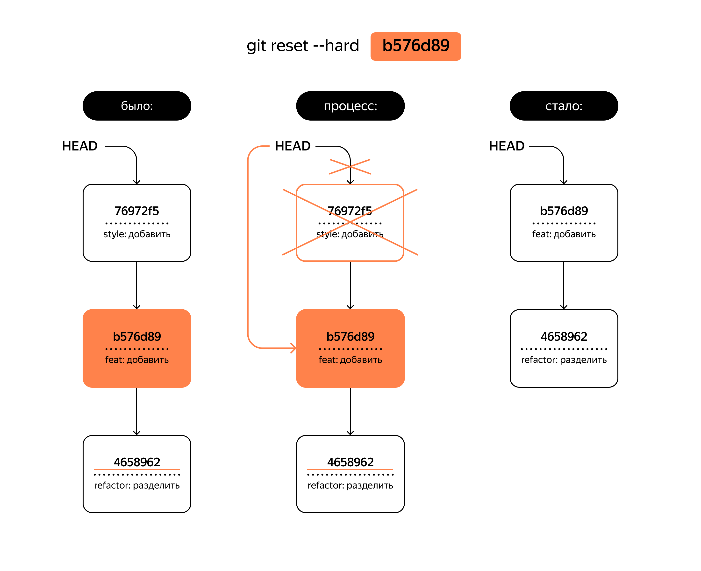

## Откат изменений

### Выполнить unstage изменений — `git restore --staged <file>`
Убрать файл из `staging`, перевести обратно в `untracked`
Только для тех файлов которые были подготовлены к коммиту командой `git add`

### «Откатить» коммит — `git reset --hard <commit hash>`
«откатить» то, что уже было закоммичено, то есть вернуть состояние репозитория к более раннему

> [!warning] Более поздние коммиты потеряются!

### «Откатить» изменения, которые не попали ни в staging, ни в коммит, — `git restore <file>`
Откатить файлы в статусе modified
 Эта команда «откатит» изменения до последней сохранённой (в коммите или в staging area) версии.